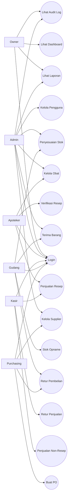
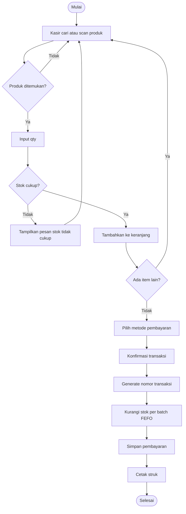
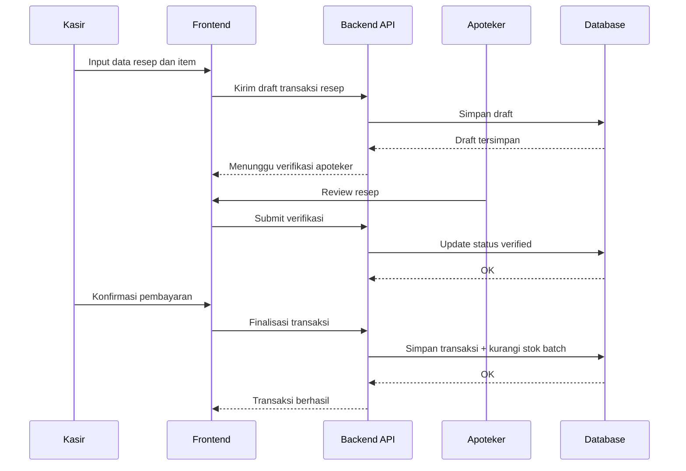
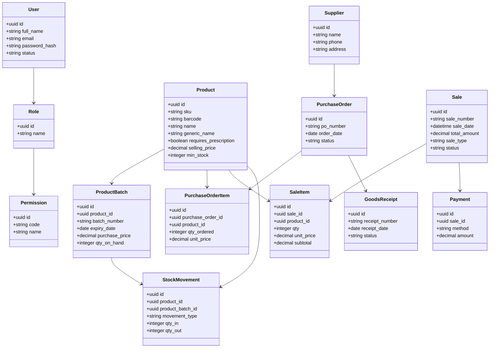
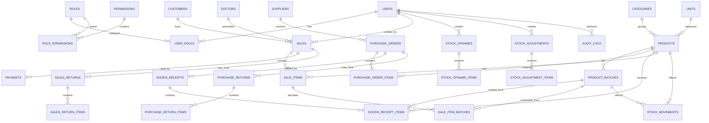

# Product Requirements Document (PRD)

## 1. Informasi Dokumen

- Nama produk: Apotek Web
- Versi dokumen: 1.0
- Tanggal: 23 Mei 2026
- Status: Draft siap implementasi
- Target platform: Web application
- Frontend utama: React + Vite + shadcn/ui
- Target pengguna: Pemilik apotek, admin, apoteker, kasir, petugas gudang, staf purchasing

## 2. Ringkasan Produk

Apotek Web adalah aplikasi berbasis web untuk mengelola operasional apotek secara end-to-end, meliputi master data obat, stok, batch dan kedaluwarsa, pembelian dari supplier, penerimaan barang, penjualan resep dan non-resep, retur, penyesuaian stok, pelaporan, audit aktivitas, serta manajemen pengguna berbasis peran.

Produk ini ditujukan untuk membantu apotek:

- Mengurangi kesalahan pencatatan manual
- Memantau stok dan tanggal kedaluwarsa secara real-time
- Mempercepat transaksi kasir
- Menjaga kepatuhan operasional farmasi
- Menyediakan laporan bisnis dan operasional yang akurat

## 3. Latar Belakang Masalah

Masalah umum pada apotek yang masih semi-manual:

- Stok obat tidak akurat antara catatan dan kondisi fisik
- Sulit memantau batch, nomor izin, dan tanggal kedaluwarsa
- Transaksi penjualan lambat karena pencarian produk dan harga manual
- Pembelian dan penerimaan barang tidak terdokumentasi rapi
- Pelaporan omzet, margin, dan fast moving/slow moving sulit dibuat
- Hak akses pengguna belum terkontrol dengan baik
- Riwayat perubahan data tidak terlacak

## 4. Tujuan Produk

### 4.1 Tujuan Bisnis

- Meningkatkan akurasi stok minimal 95%
- Mengurangi kejadian stok kosong obat utama
- Mempercepat proses transaksi kasir
- Meningkatkan visibilitas performa penjualan dan pembelian
- Menyediakan dasar sistem yang siap dikembangkan ke multi-cabang

### 4.2 Tujuan Pengguna

- Kasir dapat menyelesaikan transaksi dengan cepat dan sederhana
- Apoteker dapat memverifikasi resep dan memantau obat yang membutuhkan perhatian
- Admin dapat mengelola data master tanpa bergantung pada pencatatan manual
- Pemilik dapat melihat dashboard penjualan, laba, dan stok kritis

## 5. Sasaran dan KPI

### 5.1 KPI Utama

- Waktu rata-rata transaksi kasir: < 2 menit
- Akurasi stok harian: >= 95%
- Selisih stok opname bulanan: turun 50% dalam 3 bulan
- Persentase item kedaluwarsa tanpa tindakan: < 3%
- Ketersediaan sistem: >= 99% pada jam operasional

### 5.2 KPI Operasional

- Waktu input penerimaan barang: < 5 menit per dokumen
- Waktu pencarian obat: < 3 detik
- Waktu pembuatan laporan: real-time atau < 10 detik

## 6. Ruang Lingkup

### 6.1 In Scope MVP

- Login dan logout
- Role-based access control
- Dashboard operasional
- Manajemen master data obat
- Manajemen kategori, satuan, supplier, pelanggan
- Manajemen stok per batch dan tanggal kedaluwarsa
- Pembelian dan penerimaan barang
- Penjualan non-resep
- Penjualan resep dengan validasi apoteker
- Retur penjualan dan retur pembelian
- Penyesuaian stok dan stok opname
- Alert stok minimum dan kedaluwarsa
- Laporan penjualan, pembelian, stok, laba kotor
- Audit log aktivitas pengguna

### 6.2 Out of Scope MVP

- Integrasi BPJS/bridging rumah sakit
- Integrasi accounting eksternal
- Marketplace/online delivery
- Mobile app native
- Multi-branch real-time penuh
- E-prescription dari pihak ketiga

### 6.3 Future Scope

- Multi-cabang
- Integrasi pembayaran digital dan e-wallet
- Forecasting pembelian berbasis histori
- Loyalty pelanggan
- Integrasi WhatsApp notifikasi
- OCR resep dokter

## 7. Persona Pengguna

### 7.1 Pemilik Apotek

- Fokus: omzet, margin, stok mati, laporan
- Kebutuhan: dashboard ringkas, approval tertentu, laporan periodik

### 7.2 Admin Operasional

- Fokus: master data, pengguna, harga, pengaturan
- Kebutuhan: kontrol penuh terhadap konfigurasi sistem

### 7.3 Apoteker

- Fokus: validasi resep, substitusi obat, keamanan obat, kedaluwarsa
- Kebutuhan: visibilitas detail obat, catatan resep, batch

### 7.4 Kasir

- Fokus: transaksi cepat dan akurat
- Kebutuhan: pencarian cepat, scan barcode, hitung total otomatis, cetak struk

### 7.5 Petugas Gudang

- Fokus: stok masuk, stok keluar, batch, opname
- Kebutuhan: daftar stok, mutasi stok, warning kedaluwarsa

### 7.6 Purchasing

- Fokus: pembelian dan supplier
- Kebutuhan: PO, histori harga beli, supplier performance

## 8. Asumsi dan Batasan

- Sistem digunakan dalam satu apotek pada fase awal
- Sistem berbasis web dan diakses melalui browser desktop/tablet
- Backoffice membutuhkan koneksi internet/intranet stabil
- Printer struk dan barcode scanner dianggap sebagai perangkat pendukung opsional
- Backend/API akan disediakan terpisah dari frontend
- Database relasional menggunakan PostgreSQL

## 9. Arsitektur Solusi Tingkat Tinggi

### 9.1 Arsitektur Aplikasi

- Frontend: React + Vite + TypeScript
- UI kit: shadcn/ui
- State management: React Query untuk server state, Zustand atau Context untuk UI state ringan
- Form: React Hook Form + Zod
- Routing: React Router
- Backend: REST API
- Database: PostgreSQL
- Auth: JWT + refresh token
- Deployment frontend: static hosting atau containerized web server

### 9.2 Alasan Pemilihan Stack

- React + Vite cocok untuk dashboard internal yang cepat, modular, dan ringan
- shadcn/ui memudahkan pembuatan UI admin yang konsisten, modern, dan mudah dikustomisasi
- PostgreSQL kuat untuk transaksi, relasi, audit, dan query laporan

## 10. Prinsip UX/UI

- Tugas kasir harus bisa dilakukan dengan sedikit klik
- Layout desktop-first, tetap usable di tablet
- Komponen UI konsisten dan reusable
- Tombol aksi utama selalu jelas
- Informasi kritis seperti stok minimum, obat keras, dan kedaluwarsa harus menonjol
- Tabel mendukung filter, sort, pagination, dan export
- Form memberi validasi real-time dan pesan error yang jelas

## 11. Modul Sistem

### 11.1 Autentikasi dan Otorisasi

- Login
- Logout
- Reset password oleh admin
- Role dan permission
- Session management

### 11.2 Dashboard

- Ringkasan penjualan hari ini
- Nilai pembelian periode berjalan
- Stok kritis
- Obat mendekati kedaluwarsa
- Produk terlaris
- Notifikasi operasional

### 11.3 Master Data

- Obat
- Kategori obat
- Satuan
- Supplier
- Pelanggan
- Dokter
- Metode pembayaran
- Pajak dan konfigurasi harga

### 11.4 Inventori

- Stok per produk
- Stok per batch
- Mutasi stok
- Stok opname
- Penyesuaian stok
- Minimum stock level
- Expiry monitoring

### 11.5 Pembelian

- Purchase Request opsional
- Purchase Order
- Penerimaan barang
- Invoice supplier
- Retur pembelian

### 11.6 Penjualan

- Penjualan non-resep
- Penjualan resep
- Split pembayaran
- Diskon item/transaksi
- Cetak struk
- Retur penjualan

### 11.7 Laporan

- Laporan penjualan harian/mingguan/bulanan
- Laporan pembelian
- Laporan stok
- Laporan mutasi stok
- Laporan barang kedaluwarsa
- Laporan laba kotor
- Laporan performa supplier

### 11.8 Audit dan Keamanan

- Audit log aktivitas
- Riwayat perubahan harga
- Riwayat penyesuaian stok
- Riwayat approval

## 12. Kebutuhan Fungsional Detail

### 12.1 Autentikasi dan Pengguna

1. Sistem harus menyediakan login menggunakan username/email dan password.
2. Sistem harus mendukung role: Owner, Admin, Apoteker, Kasir, Gudang, Purchasing.
3. Sistem harus membatasi akses menu berdasarkan permission.
4. Sistem harus mencatat login, logout, dan percobaan login gagal.

### 12.2 Master Data Obat

1. Pengguna berwenang dapat membuat, melihat, mengubah, dan menonaktifkan data obat.
2. Data obat minimal mencakup kode, barcode, nama, nama generik, kategori, bentuk, satuan, golongan, status resep, stok minimum, harga beli default, harga jual, dan status aktif.
3. Sistem harus mendukung satu obat memiliki banyak batch.
4. Sistem harus mendukung pelacakan nomor batch, tanggal produksi, dan tanggal kedaluwarsa.

### 12.3 Stok dan Inventori

1. Sistem harus menghitung stok secara otomatis dari mutasi.
2. Sistem harus menampilkan stok tersedia, stok dikunci, dan stok kadaluarsa/karantina.
3. Sistem harus menyediakan stok opname dan menghasilkan selisih.
4. Sistem harus menyimpan alasan penyesuaian stok.
5. Sistem harus memberi alert untuk stok di bawah batas minimum.
6. Sistem harus memberi alert untuk obat yang akan kedaluwarsa dalam periode tertentu.

### 12.4 Pembelian

1. Purchasing dapat membuat purchase order ke supplier.
2. Gudang atau admin dapat menerima barang berdasarkan PO.
3. Sistem harus mengizinkan partial receiving.
4. Sistem harus menyimpan harga beli per batch/item.
5. Sistem harus menambah stok hanya setelah penerimaan dikonfirmasi.
6. Sistem harus mendukung retur pembelian ke supplier.

### 12.5 Penjualan

1. Kasir dapat mencari produk berdasarkan nama, kode, atau barcode.
2. Kasir dapat menambah item ke keranjang dan sistem menghitung subtotal, diskon, pajak, dan total.
3. Sistem harus menolak penjualan jika stok tidak cukup.
4. Sistem harus mendukung penjualan resep yang memerlukan verifikasi apoteker.
5. Sistem harus menyimpan detail batch yang terjual dengan metode FEFO.
6. Sistem harus mendukung pembayaran tunai dan non-tunai.
7. Sistem harus mendukung retur penjualan dengan aturan otorisasi.

### 12.6 Laporan

1. Owner dan Admin dapat melihat laporan berdasarkan rentang tanggal.
2. Laporan harus dapat difilter berdasarkan produk, kategori, supplier, pengguna, dan metode pembayaran.
3. Laporan harus dapat diekspor ke CSV/XLSX/PDF pada fase implementasi.

### 12.7 Audit Log

1. Sistem harus mencatat create, update, delete, approve, cancel, dan login event.
2. Log minimal menyimpan pengguna, waktu, entitas, aksi, dan snapshot perubahan ringkas.

## 13. Kebutuhan Non-Fungsional

### 13.1 Performa

- Waktu respon halaman dashboard <= 3 detik pada data normal
- Waktu pencarian produk <= 2 detik
- Submit transaksi <= 3 detik

### 13.2 Availability

- Sistem tersedia pada jam operasional dengan target 99%

### 13.3 Security

- Password di-hash
- Session/token aman
- Role-based access control wajib
- Audit log untuk aksi sensitif
- Validasi input di frontend dan backend

### 13.4 Reliability

- Transaksi stok dan penjualan harus atomic
- Tidak boleh terjadi stok negatif akibat race condition

### 13.5 Maintainability

- Frontend modular per domain
- Reusable component berbasis shadcn/ui
- API contract terdokumentasi

### 13.6 Scalability

- Skema mendukung ekspansi ke multi-outlet
- Database siap indexing untuk query laporan

## 14. Business Rules

1. Obat resep hanya dapat dijual melalui alur resep atau dengan approval role tertentu.
2. Pengeluaran stok penjualan harus menggunakan prinsip FEFO.
3. Batch yang sudah kedaluwarsa tidak boleh dijual.
4. Retur penjualan tidak boleh melebihi jumlah pembelian awal.
5. Harga jual dapat diubah hanya oleh role tertentu.
6. Selisih stok opname di atas ambang batas harus melalui approval.
7. PO yang sudah ditutup tidak dapat diubah.
8. Produk nonaktif tidak dapat dipakai di transaksi baru.

## 15. User Flow Utama

### 15.1 Flow Penjualan Non-Resep

1. Kasir login
2. Kasir buka halaman POS
3. Kasir scan/cari obat
4. Sistem validasi stok dan harga
5. Kasir pilih jumlah
6. Sistem hitung total
7. Kasir pilih metode bayar
8. Sistem simpan transaksi
9. Sistem kurangi stok berdasarkan batch FEFO
10. Sistem cetak/unduh struk

### 15.2 Flow Penjualan Resep

1. Kasir input data resep
2. Apoteker verifikasi resep
3. Sistem validasi obat dan stok
4. Kasir selesaikan pembayaran
5. Sistem simpan transaksi dan batch yang digunakan

### 15.3 Flow Pembelian dan Penerimaan

1. Purchasing buat PO
2. Supplier kirim barang
3. Gudang terima barang
4. Gudang input batch, qty diterima, tanggal kedaluwarsa
5. Sistem update stok
6. Sistem tandai PO parsial atau selesai

## 16. Daftar Use Case

| Kode | Use Case | Aktor | Deskripsi Singkat |
|---|---|---|---|
| UC-01 | Login | Semua pengguna | Masuk ke sistem |
| UC-02 | Kelola pengguna | Admin | CRUD pengguna dan role |
| UC-03 | Kelola master obat | Admin/Apoteker | CRUD data obat |
| UC-04 | Kelola supplier | Admin/Purchasing | CRUD supplier |
| UC-05 | Buat purchase order | Purchasing | Membuat pesanan ke supplier |
| UC-06 | Terima barang | Gudang/Admin | Input penerimaan dan batch |
| UC-07 | Lakukan penjualan non-resep | Kasir | Transaksi POS umum |
| UC-08 | Verifikasi resep | Apoteker | Validasi transaksi resep |
| UC-09 | Lakukan penjualan resep | Kasir/Apoteker | Transaksi obat resep |
| UC-10 | Retur penjualan | Kasir/Admin | Mengembalikan transaksi penjualan |
| UC-11 | Retur pembelian | Purchasing/Gudang | Mengembalikan barang ke supplier |
| UC-12 | Stok opname | Gudang/Admin | Cek fisik dan cocokkan stok |
| UC-13 | Penyesuaian stok | Admin/Gudang | Koreksi stok |
| UC-14 | Lihat dashboard | Owner/Admin | Ringkasan operasional |
| UC-15 | Lihat laporan | Owner/Admin | Akses laporan bisnis |
| UC-16 | Lihat audit log | Owner/Admin | Telusuri aktivitas pengguna |

## 17. Use Case Specification Contoh

### 17.1 UC-07 Lakukan Penjualan Non-Resep

- Aktor utama: Kasir
- Precondition: Kasir login dan memiliki akses POS
- Trigger: Kasir memilih menu penjualan
- Alur utama:
  1. Kasir mencari atau scan produk
  2. Sistem menampilkan produk dan stok
  3. Kasir memasukkan kuantitas
  4. Sistem menghitung subtotal, diskon, pajak, dan total
  5. Kasir memilih metode pembayaran
  6. Sistem menyimpan transaksi
  7. Sistem mengurangi stok per batch FEFO
  8. Sistem menghasilkan struk
- Alternate flow:
  1. Jika stok tidak cukup, sistem menolak item
  2. Jika produk kedaluwarsa, sistem menolak penjualan
- Postcondition: Transaksi tercatat dan stok terbarui

### 17.2 UC-06 Terima Barang

- Aktor utama: Gudang
- Precondition: PO telah dibuat
- Trigger: Barang dari supplier tiba
- Alur utama:
  1. Gudang membuka PO
  2. Gudang input qty diterima per item
  3. Gudang input batch dan expiry
  4. Sistem memvalidasi data
  5. Sistem menambah stok
  6. Sistem memperbarui status PO
- Postcondition: Stok bertambah dan penerimaan tercatat

## 18. UML Use Case Diagram



## 19. UML Activity Diagram Penjualan



## 20. UML Sequence Diagram Penjualan Resep



## 21. Domain Model / UML Class Diagram



## 22. Desain Database

### 22.1 Entitas Utama

- users
- roles
- permissions
- role_permissions
- user_roles
- categories
- units
- products
- product_batches
- suppliers
- customers
- doctors
- purchase_orders
- purchase_order_items
- goods_receipts
- goods_receipt_items
- sales
- sale_items
- sale_item_batches
- payments
- stock_movements
- stock_opnames
- stock_opname_items
- stock_adjustments
- stock_adjustment_items
- sales_returns
- sales_return_items
- purchase_returns
- purchase_return_items
- audit_logs

### 22.2 ERD Ringkas



### 22.3 Data Dictionary Ringkas

#### Tabel `users`

| Kolom | Tipe | Keterangan |
|---|---|---|
| id | uuid PK | ID pengguna |
| full_name | varchar(150) | Nama lengkap |
| email | varchar(150) unique | Email login |
| username | varchar(100) unique | Username |
| password_hash | text | Password hash |
| status | varchar(20) | active, inactive, locked |
| last_login_at | timestamp | Login terakhir |
| created_at | timestamp | Waktu buat |
| updated_at | timestamp | Waktu ubah |

#### Tabel `products`

| Kolom | Tipe | Keterangan |
|---|---|---|
| id | uuid PK | ID produk |
| category_id | uuid FK | Kategori |
| unit_id | uuid FK | Satuan |
| sku | varchar(50) unique | Kode produk |
| barcode | varchar(100) nullable | Barcode |
| name | varchar(200) | Nama produk |
| generic_name | varchar(200) nullable | Nama generik |
| form | varchar(100) nullable | Bentuk sediaan |
| strength | varchar(100) nullable | Dosis/kekuatan |
| requires_prescription | boolean | Obat resep atau tidak |
| is_controlled_substance | boolean | Obat khusus |
| min_stock | integer | Batas minimum |
| default_purchase_price | numeric(14,2) | Harga beli default |
| selling_price | numeric(14,2) | Harga jual |
| is_active | boolean | Status aktif |
| created_at | timestamp | Waktu buat |
| updated_at | timestamp | Waktu ubah |

#### Tabel `product_batches`

| Kolom | Tipe | Keterangan |
|---|---|---|
| id | uuid PK | ID batch |
| product_id | uuid FK | Produk |
| batch_number | varchar(100) | Nomor batch |
| manufacture_date | date nullable | Tanggal produksi |
| expiry_date | date | Tanggal kedaluwarsa |
| purchase_price | numeric(14,2) | Harga beli batch |
| qty_on_hand | integer | Qty saat ini |
| qty_reserved | integer | Qty reserve |
| location_code | varchar(50) nullable | Lokasi rak |
| status | varchar(20) | active, expired, quarantined |
| created_at | timestamp | Waktu buat |
| updated_at | timestamp | Waktu ubah |

#### Tabel `purchase_orders`

| Kolom | Tipe | Keterangan |
|---|---|---|
| id | uuid PK | ID PO |
| supplier_id | uuid FK | Supplier |
| po_number | varchar(50) unique | Nomor PO |
| order_date | date | Tanggal PO |
| expected_date | date nullable | Estimasi datang |
| status | varchar(20) | draft, approved, partial, completed, cancelled |
| subtotal | numeric(14,2) | Nilai sebelum diskon/pajak |
| discount_amount | numeric(14,2) | Diskon |
| tax_amount | numeric(14,2) | Pajak |
| total_amount | numeric(14,2) | Total |
| notes | text nullable | Catatan |
| created_by | uuid FK | Pembuat |
| created_at | timestamp | Waktu buat |
| updated_at | timestamp | Waktu ubah |

#### Tabel `sales`

| Kolom | Tipe | Keterangan |
|---|---|---|
| id | uuid PK | ID transaksi |
| sale_number | varchar(50) unique | Nomor transaksi |
| customer_id | uuid FK nullable | Pelanggan |
| doctor_id | uuid FK nullable | Dokter pemberi resep |
| cashier_id | uuid FK | Kasir |
| pharmacist_id | uuid FK nullable | Verifikator resep |
| sale_type | varchar(20) | otc, prescription |
| status | varchar(20) | draft, paid, cancelled, returned_partial, returned_full |
| subtotal | numeric(14,2) | Subtotal |
| discount_amount | numeric(14,2) | Diskon |
| tax_amount | numeric(14,2) | Pajak |
| total_amount | numeric(14,2) | Total |
| paid_amount | numeric(14,2) | Dibayar |
| change_amount | numeric(14,2) | Kembalian |
| notes | text nullable | Catatan |
| sold_at | timestamp | Waktu transaksi |
| created_at | timestamp | Waktu buat |
| updated_at | timestamp | Waktu ubah |

#### Tabel `stock_movements`

| Kolom | Tipe | Keterangan |
|---|---|---|
| id | uuid PK | ID mutasi |
| product_id | uuid FK | Produk |
| product_batch_id | uuid FK nullable | Batch |
| movement_type | varchar(30) | purchase_receipt, sale, sale_return, purchase_return, adjustment_in, adjustment_out, opname, expired |
| reference_type | varchar(50) | Entitas asal |
| reference_id | uuid | ID entitas asal |
| qty_in | integer | Qty masuk |
| qty_out | integer | Qty keluar |
| unit_cost | numeric(14,2) nullable | Harga modal |
| notes | text nullable | Catatan |
| created_by | uuid FK | Pembuat |
| created_at | timestamp | Waktu buat |

## 23. SQL Skema Awal

```sql
create extension if not exists "pgcrypto";

create table roles (
  id uuid primary key default gen_random_uuid(),
  name varchar(50) not null unique,
  created_at timestamp not null default now(),
  updated_at timestamp not null default now()
);

create table users (
  id uuid primary key default gen_random_uuid(),
  full_name varchar(150) not null,
  email varchar(150) not null unique,
  username varchar(100) not null unique,
  password_hash text not null,
  status varchar(20) not null default 'active',
  last_login_at timestamp null,
  created_at timestamp not null default now(),
  updated_at timestamp not null default now()
);

create table user_roles (
  id uuid primary key default gen_random_uuid(),
  user_id uuid not null references users(id),
  role_id uuid not null references roles(id),
  unique (user_id, role_id)
);

create table categories (
  id uuid primary key default gen_random_uuid(),
  name varchar(100) not null,
  description text null
);

create table units (
  id uuid primary key default gen_random_uuid(),
  name varchar(50) not null,
  symbol varchar(20) not null
);

create table suppliers (
  id uuid primary key default gen_random_uuid(),
  name varchar(150) not null,
  phone varchar(50) null,
  email varchar(150) null,
  address text null,
  is_active boolean not null default true,
  created_at timestamp not null default now(),
  updated_at timestamp not null default now()
);

create table products (
  id uuid primary key default gen_random_uuid(),
  category_id uuid not null references categories(id),
  unit_id uuid not null references units(id),
  sku varchar(50) not null unique,
  barcode varchar(100) null,
  name varchar(200) not null,
  generic_name varchar(200) null,
  form varchar(100) null,
  strength varchar(100) null,
  requires_prescription boolean not null default false,
  is_controlled_substance boolean not null default false,
  min_stock integer not null default 0,
  default_purchase_price numeric(14,2) not null default 0,
  selling_price numeric(14,2) not null default 0,
  is_active boolean not null default true,
  created_at timestamp not null default now(),
  updated_at timestamp not null default now()
);

create table product_batches (
  id uuid primary key default gen_random_uuid(),
  product_id uuid not null references products(id),
  batch_number varchar(100) not null,
  manufacture_date date null,
  expiry_date date not null,
  purchase_price numeric(14,2) not null default 0,
  qty_on_hand integer not null default 0,
  qty_reserved integer not null default 0,
  location_code varchar(50) null,
  status varchar(20) not null default 'active',
  created_at timestamp not null default now(),
  updated_at timestamp not null default now(),
  unique (product_id, batch_number)
);

create table purchase_orders (
  id uuid primary key default gen_random_uuid(),
  supplier_id uuid not null references suppliers(id),
  po_number varchar(50) not null unique,
  order_date date not null,
  expected_date date null,
  status varchar(20) not null default 'draft',
  subtotal numeric(14,2) not null default 0,
  discount_amount numeric(14,2) not null default 0,
  tax_amount numeric(14,2) not null default 0,
  total_amount numeric(14,2) not null default 0,
  notes text null,
  created_by uuid not null references users(id),
  created_at timestamp not null default now(),
  updated_at timestamp not null default now()
);

create table purchase_order_items (
  id uuid primary key default gen_random_uuid(),
  purchase_order_id uuid not null references purchase_orders(id) on delete cascade,
  product_id uuid not null references products(id),
  qty_ordered integer not null,
  qty_received integer not null default 0,
  unit_price numeric(14,2) not null default 0,
  discount_amount numeric(14,2) not null default 0,
  tax_amount numeric(14,2) not null default 0,
  subtotal numeric(14,2) not null default 0
);

create table sales (
  id uuid primary key default gen_random_uuid(),
  sale_number varchar(50) not null unique,
  cashier_id uuid not null references users(id),
  pharmacist_id uuid null references users(id),
  sale_type varchar(20) not null,
  status varchar(20) not null default 'paid',
  subtotal numeric(14,2) not null default 0,
  discount_amount numeric(14,2) not null default 0,
  tax_amount numeric(14,2) not null default 0,
  total_amount numeric(14,2) not null default 0,
  paid_amount numeric(14,2) not null default 0,
  change_amount numeric(14,2) not null default 0,
  notes text null,
  sold_at timestamp not null default now(),
  created_at timestamp not null default now(),
  updated_at timestamp not null default now()
);

create table sale_items (
  id uuid primary key default gen_random_uuid(),
  sale_id uuid not null references sales(id) on delete cascade,
  product_id uuid not null references products(id),
  qty integer not null,
  unit_price numeric(14,2) not null default 0,
  discount_amount numeric(14,2) not null default 0,
  tax_amount numeric(14,2) not null default 0,
  subtotal numeric(14,2) not null default 0
);

create table payments (
  id uuid primary key default gen_random_uuid(),
  sale_id uuid not null references sales(id) on delete cascade,
  method varchar(30) not null,
  amount numeric(14,2) not null default 0,
  paid_at timestamp not null default now()
);

create table stock_movements (
  id uuid primary key default gen_random_uuid(),
  product_id uuid not null references products(id),
  product_batch_id uuid null references product_batches(id),
  movement_type varchar(30) not null,
  reference_type varchar(50) not null,
  reference_id uuid not null,
  qty_in integer not null default 0,
  qty_out integer not null default 0,
  unit_cost numeric(14,2) null,
  notes text null,
  created_by uuid not null references users(id),
  created_at timestamp not null default now()
);

create index idx_products_name on products(name);
create index idx_products_barcode on products(barcode);
create index idx_product_batches_expiry on product_batches(expiry_date);
create index idx_sales_sold_at on sales(sold_at);
create index idx_stock_movements_product on stock_movements(product_id, created_at);
```

## 24. Rancangan API Tingkat Tinggi

### 24.1 Endpoint Inti

- `POST /auth/login`
- `POST /auth/refresh`
- `POST /auth/logout`
- `GET /dashboard/summary`
- `GET /products`
- `POST /products`
- `GET /products/:id`
- `PATCH /products/:id`
- `GET /inventory/stock`
- `GET /inventory/expiries`
- `POST /purchase-orders`
- `GET /purchase-orders`
- `POST /goods-receipts`
- `POST /sales`
- `POST /sales/:id/verify-prescription`
- `POST /sales/:id/returns`
- `POST /stock-opnames`
- `POST /stock-adjustments`
- `GET /reports/sales`
- `GET /reports/purchases`
- `GET /reports/inventory`
- `GET /audit-logs`

## 25. Struktur Informasi Frontend

### 25.1 Sitemap

- `/login`
- `/dashboard`
- `/master/products`
- `/master/categories`
- `/master/units`
- `/master/suppliers`
- `/master/customers`
- `/inventory/stock`
- `/inventory/batches`
- `/inventory/opname`
- `/inventory/adjustments`
- `/purchasing/purchase-orders`
- `/purchasing/receipts`
- `/sales/pos`
- `/sales/prescriptions`
- `/sales/returns`
- `/reports/sales`
- `/reports/purchases`
- `/reports/stock`
- `/reports/expiries`
- `/settings/users`
- `/settings/roles`
- `/audit-logs`

### 25.2 Struktur Frontend yang Direkomendasikan

```txt
src/
  app/
    router/
    providers/
    layouts/
  features/
    auth/
    dashboard/
    products/
    inventory/
    purchasing/
    sales/
    reports/
    settings/
    audit/
  components/
    ui/
    shared/
  lib/
    api/
    utils/
    constants/
    validators/
  hooks/
  types/
```

## 26. Komponen UI Utama dengan shadcn/ui

- `DataTable` untuk list master dan laporan
- `Form`, `Input`, `Select`, `Textarea`, `Checkbox`, `RadioGroup`
- `Dialog` untuk create/edit modal
- `Drawer` untuk detail cepat
- `Tabs` untuk detail obat dan histori batch
- `Card` untuk dashboard metrics
- `Badge` untuk status stok, expiry, resep
- `Toast` untuk notifikasi aksi
- `AlertDialog` untuk aksi destruktif
- `Calendar`/`Date Picker` untuk filter laporan
- `Sheet` untuk quick actions di POS

## 27. Hak Akses Per Role

| Modul | Owner | Admin | Apoteker | Kasir | Gudang | Purchasing |
|---|---|---|---|---|---|---|
| Dashboard | V | V | V | V | V | V |
| Master Obat | V | CUD | CUD terbatas | R | R | R |
| Pengguna & Role | R | CUD | - | - | - | - |
| Purchase Order | R | R | - | - | R | CUD |
| Penerimaan Barang | R | CUD | - | - | CUD | R |
| Penjualan Non-Resep | R | R | R | CUD | - | - |
| Penjualan Resep | R | R | Approve | CUD | - | - |
| Stok Opname | R | R | R | - | CUD | - |
| Penyesuaian Stok | R | Approve/CUD | R | - | Create | - |
| Laporan | V | V | V terbatas | V terbatas | V terbatas | V terbatas |
| Audit Log | V | V | - | - | - | - |

Keterangan:

- `V`: view
- `R`: read
- `CUD`: create, update, delete

## 28. Acceptance Criteria per Modul

### 28.1 POS

- Kasir dapat menambahkan item lewat pencarian nama atau barcode
- Sistem menolak item bila stok tidak cukup
- Total belanja terhitung otomatis
- Transaksi tersimpan dan stok berkurang setelah pembayaran sukses

### 28.2 Inventori

- Pengguna dapat melihat stok per produk dan per batch
- Sistem menampilkan obat mendekati kedaluwarsa
- Stok opname menghasilkan selisih otomatis

### 28.3 Pembelian

- PO dapat dibuat dan memiliki status jelas
- Penerimaan barang dapat parsial
- Stok bertambah sesuai batch yang diterima

### 28.4 Laporan

- Pengguna dapat filter laporan berdasarkan tanggal
- Nilai total penjualan dan pembelian akurat sesuai transaksi

## 29. Risiko dan Mitigasi

| Risiko | Dampak | Mitigasi |
|---|---|---|
| Data master tidak rapi | Salah transaksi dan laporan | Validasi ketat, wajib field penting |
| Salah input batch/expiry | Risiko obat salah jual | Form penerimaan dengan validasi dan review |
| Konflik update stok | Stok tidak akurat | Atomic transaction dan row locking |
| Akses tidak terkontrol | Risiko keamanan | RBAC dan audit log |
| Pengguna sulit adaptasi | Adopsi lambat | UI sederhana dan pelatihan singkat |

## 30. Rencana Implementasi Bertahap

### Phase 1

- Setup project frontend
- Auth dan layout dashboard
- Master data inti
- POS dasar non-resep
- Inventori dasar

### Phase 2

- Pembelian dan penerimaan
- Batch FEFO
- Penjualan resep
- Laporan inti

### Phase 3

- Retur
- Stok opname lengkap
- Audit log
- Optimasi laporan dan export

## 31. Open Questions

- Apakah apotek akan menggunakan satu gudang atau banyak lokasi rak?
- Apakah transaksi resep perlu menyimpan upload foto resep?
- Apakah harga jual mengikuti margin tetap atau manual per produk?
- Apakah pajak diterapkan per item atau per transaksi?
- Apakah perlu dukungan multi-cabang dalam 6-12 bulan?

## 32. Rekomendasi Teknis untuk Build

### 32.1 Frontend

- Gunakan TypeScript sejak awal
- Gunakan route grouping berbasis domain
- Gunakan reusable table dan form wrapper
- Pisahkan server state dari UI state

### 32.2 Backend

- Terapkan transaction untuk sales, returns, receipts, adjustments
- Gunakan soft delete untuk master data penting
- Simpan audit log untuk semua perubahan sensitif

### 32.3 Database

- Index pada kolom pencarian dan transaksi
- Gunakan constraint untuk mencegah data duplikat
- Siapkan view/materialized view untuk laporan berat bila volume meningkat

## 33. Kesimpulan

Dokumen ini mendefinisikan kebutuhan lengkap MVP aplikasi web apotek dengan fondasi operasional yang kuat. Dengan pendekatan `React + Vite + shadcn/ui` di frontend dan database relasional di backend, sistem ini siap dikembangkan menjadi aplikasi apotek modern yang cepat, terukur, aman, dan mudah di-maintain.
